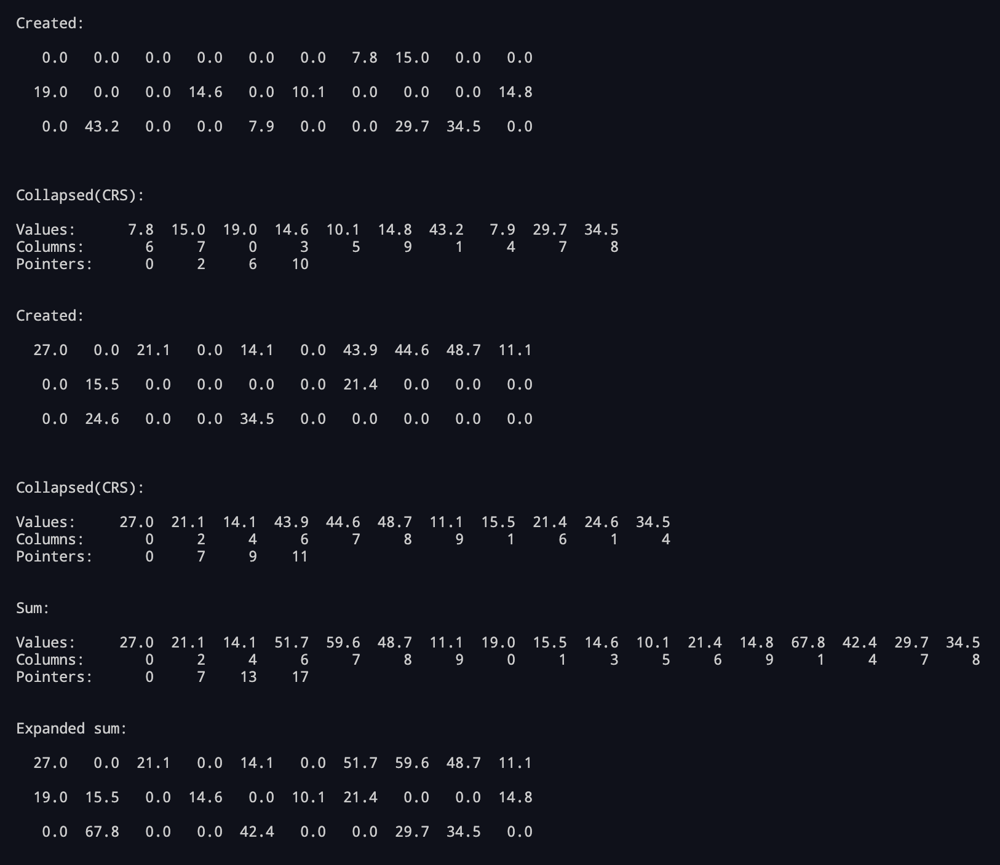

# compressed-row-storage
Типы и структуры данных - Лабораторная работа - Хранение разреженных матриц (разреженный строчный формат), сложение свернутых матриц



Запуск консольного приложения:
```
go run cmd/crs-lab/main.go
```